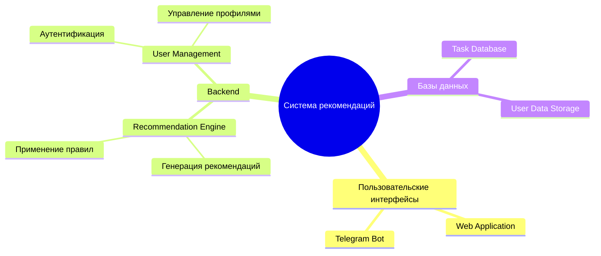
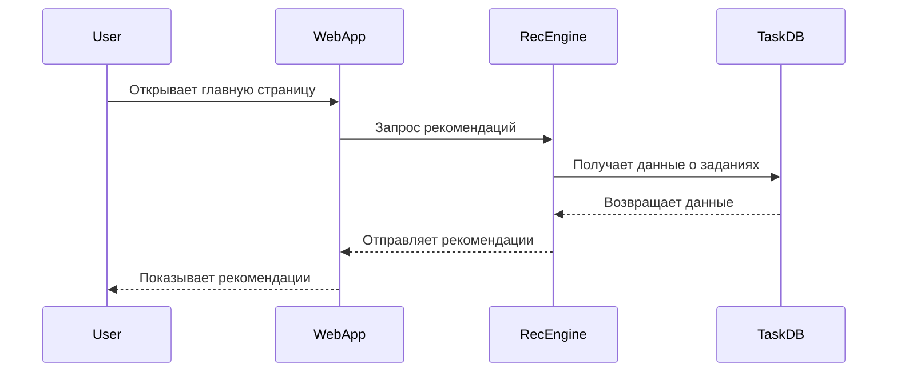

# Архитектура системы рекомендаций


### Пояснение:
- **Пользовательские интерфейсы:** Веб-приложение и интеграция с ботом Telegram.
- **Backend:** Основные модули, включая движок рекомендаций и управление пользователями.
- **Базы данных:** Хранение данных заданий и информации о пользователях.

---

## Sequence Diagram

**Описание:** Показывает последовательность взаимодействий пользователя с системой рекомендаций.

```markdown
# Последовательность взаимодействий



### Пояснение:
1. **User:** Начинает взаимодействие с веб-приложением.
2. **WebApp:** Запрашивает данные у движка рекомендаций.
3. **RecEngine:** Обрабатывает запрос и обращается к базе данных.
4. **TaskDB:** Возвращает необходимые данные для генерации рекомендаций.

---

## Git Graph

**Описание:** Демонстрирует процесс разработки с ветками и слияниями.

```markdown
# История разработки


### Пояснение:
- **Feature/login:** Разработка функций авторизации.
- **Feature/recommendations:** Движок рекомендаций с интеграцией машинного обучения.
- **Feature/notifications:** Реализация системы уведомлений.

---

## Quadrant Chart

**Описание:** Приоритизация функционала по степени важности и вовлечённости.

```markdown
# Приоритизация функциональных возможностей


### Пояснение:
- **High Priority:** Критически важные функции для системы.
- **Need Further Promotion:** Функции с высоким потенциалом роста.
- **Low Priority:** Модули, требующие переоценки.
- **Improvement Opportunities:** Функции с низкой вовлечённостью, требующие улучшений.
